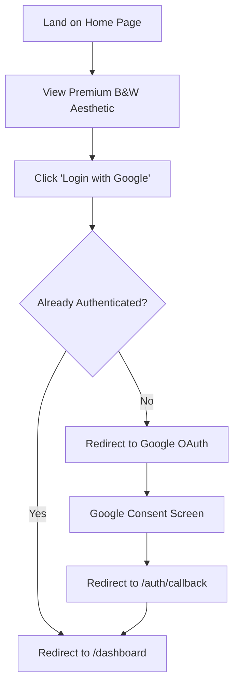

## 1. Product Overview
Highwatch RAG Home Page Revamp
- Redesign the landing page of the Highwatch RAG application to use a premium, black and white minimalist aesthetic with "white glass" effects and high-quality animations.
- The target is to create a sleek, professional, and visually striking entrance for users before they log in via Google OAuth.

## 2. Core Features

### 2.1 User Roles
| Role | Registration Method | Core Permissions |
|------|---------------------|------------------|
| Authenticated User | Google OAuth | Access Dashboard, Sync Drive, Chat with AI |
| Guest | N/A | View Home Page, Login via Google |

### 2.2 Feature Module
1. **Home Page**: Hero section with bold typography, "Login with Google" CTA, and animated background/glass elements.

### 2.3 Page Details
| Page Name | Module Name | Feature description |
|-----------|-------------|---------------------|
| Home Page | Hero Section | Premium black and white aesthetic. Floating white glass blobs/shapes instead of colored ones. Smooth entrance animations (Framer Motion). "Login with Google" button. |

## 3. Core Process
1. User lands on Home Page.
2. User experiences premium entrance animations and white glass aesthetic.
3. User clicks "Login with Google".
4. App checks `/auth/status`. If logged in, redirects to Dashboard. If not, redirects to Google OAuth flow.

## 4. User Interface Design
### 4.1 Design Style
- **Colors**: Strictly Black (`#000000`, `zinc-950`) and White (`#FFFFFF`, `zinc-50`), with varying opacities for depth (greyscale).
- **Glass Effect**: "White Glass" - translucent white backgrounds (`bg-white/5` or `bg-white/10`) with strong `backdrop-blur-xl` and subtle white borders (`border-white/10`).
- **Typography**: Bold, clean sans-serif. High contrast.
- **Animations**: Slow, smooth floating animations for background blobs. Elegant staggered fade-in and slide-up for text elements. Hover states with subtle scaling and glowing white drop shadows.

### 4.2 Page Design Overview
| Page Name | Module Name | UI Elements |
|-----------|-------------|-------------|
| Home Page | Hero | Dynamic background with animated, blurred white/grey blobs. Glassmorphic cards/badges. High-contrast typography. Monochromatic feature grid. |

### 4.3 Responsiveness
Desktop-first approach, fully responsive on mobile devices with stacked layouts and adjusted typography scaling.
