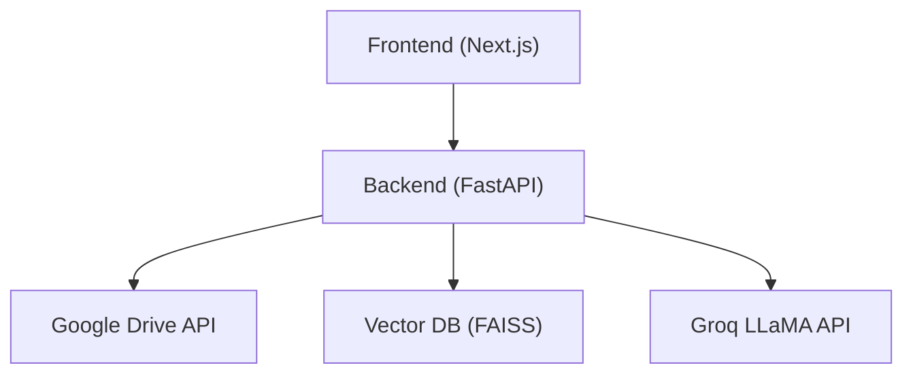

## 1. Architecture Design

## 2. Technology Description
- Frontend: `React@18` + `Next.js` + `TailwindCSS@3`
- Animation: `framer-motion`
- Icons: `lucide-react`
- State/HTTP: `axios`

## 3. Route Definitions
| Route | Purpose |
|-------|---------|
| `/` | Premium B&W animated Home page |
| `/dashboard` | Main app interface (protected) |

## 4. API Definitions
- `GET /auth/status`: Check login status
- `GET /auth/login`: Start OAuth flow
- `GET /auth/callback`: OAuth redirect handler
