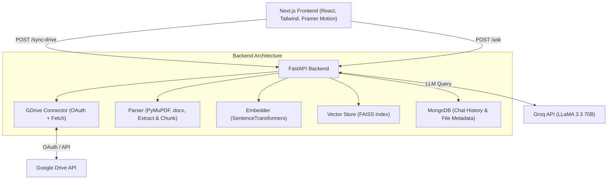

# Highwatch RAG - Google Drive AI Q&A System

A premium, production-ready AI SaaS application that connects directly to your Google Drive. It extracts text from your personal PDFs, Docs, and TXT files, embeds them into a FAISS vector database, and lets you chat with your documents using Groq's blazing-fast **LLaMA 3.3 (70B)** model.


---

## ✨ Features

- **Google Drive OAuth Integration**: Securely connect and ingest files directly from your Google Drive.
- **Advanced RAG Pipeline**: Extracts, chunks, and embeds text into a local FAISS vector database using `SentenceTransformers`.
- **LLaMA 3.3 (70B) Intelligence**: Powered by Groq's LPU inference engine for lightning-fast, GPT-4 class reasoning.
- **Conversational Memory**: The AI remembers your previous questions and understands context (pronouns, follow-ups) flawlessly.
- **Smart Sync**: Uses MongoDB to track file metadata, ensuring it only downloads *new* or *modified* files, saving massive bandwidth.


---

## 🏗️ Architecture Diagram



---

## 🛠️ Setup & Installation

### 1. Prerequisites
- Node.js (v18+)
- Python (v3.9+)
- A [Groq](https://console.groq.com) API Key (Free)
- A [MongoDB Atlas](https://www.mongodb.com/cloud/atlas) Cluster URI (Free)
- Google Cloud Console OAuth 2.0 Client IDs (`credentials.json`)

### 2. Environment Variables
Create a `.env` file in the root of the project (use `.env.example` as a template):

```env
# BACKEND
GROQ_API_KEY=your_groq_api_key_here
MONGO_URI=your_mongodb_atlas_uri_here
FRONTEND_URL=http://localhost:3000
API_URL=http://localhost:8000
PORT=8000
ENVIRONMENT=development
GOOGLE_CREDENTIALS_PATH=./backend/credentials.json

# FRONTEND
NEXT_PUBLIC_API_URL=http://localhost:8000
```

### 3. Start the Backend (FastAPI)
```bash
cd backend
python3 -m venv venv
source venv/bin/activate
pip install -r requirements.txt
python main.py
```
*(Server runs on http://localhost:8000)*

### 4. Start the Frontend (Next.js)
```bash
cd frontend
npm install
npm run dev
```
*(App runs on http://localhost:3000)*

---

## 🚀 Deployment Guide (Production)

This repository is fully configured for deployment on modern cloud platforms (Vercel, Render, Heroku).

### Frontend (Vercel)
1. Push your code to GitHub (ensure `.env` and `credentials.json` are in `.gitignore`!).
2. Import the `frontend/` folder into Vercel.
3. Set the Environment Variable: `NEXT_PUBLIC_API_URL = https://your-backend-url.com`.
4. Deploy.

### Backend (Render / Railway)
1. Create a new Web Service pointing to the `backend/` folder.
2. Upload your `credentials.json` as a Secret File (e.g., to `/etc/secrets/credentials.json`).
3. Set Environment Variables:
   - `GROQ_API_KEY`
   - `MONGO_URI`
   - `FRONTEND_URL` (Your Vercel URL)
   - `API_URL` (Your Render URL)
   - `GOOGLE_CREDENTIALS_PATH` (e.g., `/etc/secrets/credentials.json`)
4. Set the Start Command: `uvicorn main:app --host 0.0.0.0 --port $PORT`
5. **Crucial**: Go to your Google Cloud Console and add `https://your-backend-url.com/auth/callback` to your OAuth Authorized Redirect URIs.

---

## 💡 Sample Usage

1. Click **Login with Google** on the Home Page.
2. Authorize the app to read your Google Drive.
3. Click **Sync Drive** in the Dashboard sidebar. Wait while the backend downloads, parses, and embeds your documents.
4. Ask a question in the Chat:
   > *"What are the key features of the new product mentioned in the Q3 launch doc?"*
5. Ask a conversational follow-up:
   > *"And who is the team lead for that?"* (The AI will remember the context of the previous question!)
